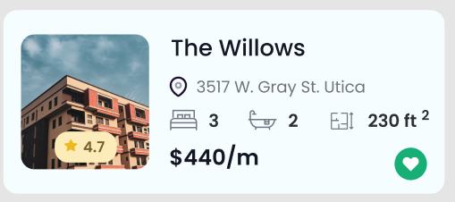
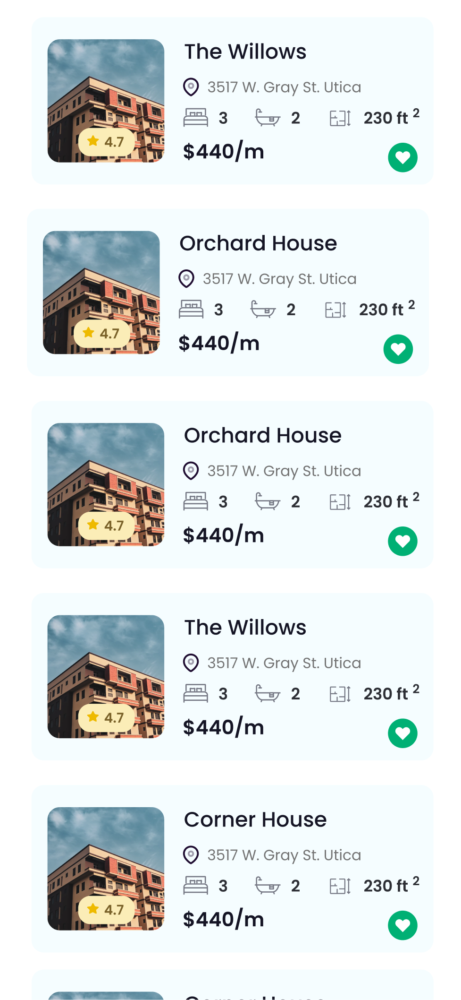

-   [App Inmobiliaria](#-app-inmobiliaria)
-   [Palabras clave](#key-palabras-clave)
-   [Objetivo](#-objetivo)
-   [Instrucciones](#-instrucciones)
-   [Entregables](#-entregables)
-   [Tecnologías](#-tecnologías)
-   [Requerimientos funcionales](#computer-requerimientos-funcionales)
-   [Diseño](#diseño)
-   [Requerimientos no-funcionales](#-requerimientos-no-funcionales)
-   [Flujo de trabajo sugerido](#bulb-flujo-de-trabajo-sugerido)
-   [Indicadores de cumplimiento](#-indicadores-de-cumplimiento)
-   [Recursos](#-recursos)
  
# 🚀 App Inmobiliaria

-   **Organización.** [Individual](https://github.com/BrightCoders-Institute/handbook/wiki/Actividades#actividades-individuales-as%C3%ADncronas)
-   **Modo.** [Asíncrono](https://github.com/BrightCoders-Institute/handbook/wiki/Actividades#actividades-individuales-as%C3%ADncronas)
-   **Estrategia.** Programación individual
-   **Duración.** 8 días
-   **Dedicación.** 1.5 horas diarias (12 horas total)

# :key: Palabras clave

`React Native`, `Programación por componentes`, `Componentes reutilizables`, `Interfaces para aplicaciones móviles`, `Diseño y construcción de pantallas interactivas`, `Buenas prácticas de desarrollo de software`, `Herramientas de análisis de código estático (Codacy, CodeClimate, CodeCov)`, `Pruebas unitarias`, `Herramientas de control de versiones (Git, GitHub)`, `Resolución de problemas`, `Toma de decisiones`, `Principios SOLID, DRY, KISS, YAGNI`, `Estructuración del código orientada a objetos`, `Métodos pequeños y cohesivos`, `Commits significativos y colaborativos`, `React Native`, `JavaScript o TypeScript`, `ESLint`, `Jest`

# 🎯 Objetivo

-   Iniciar en la programación con React Native, proporcionando una introducción práctica a la creación de aplicaciones móviles.
-   Familiarizar con el modelo de programación por componentes de React Native, enseñándoles a crear y utilizar componentes reutilizables.
-   Introducir el desarrollo de interfaces para aplicaciones móviles utilizando React Native, enseñando a los participantes a diseñar y construir pantallas interactivas y atractivas.
-   Aplicar buenas prácticas de desarrollo de software, incluyendo el uso de herramientas de análisis de código estático (Codacy, CodeClimate, CodeCov).
-   Promover la escritura de pruebas unitarias para asegurar la funcionalidad y la robustez de la aplicación móvil desarrollada.
-   Introducir el uso de herramientas de control de versiones (como Git y GitHub).
-   Desarrollar habilidades de resolución de problemas y toma de decisiones a medida que los participantes enfrentan desafíos técnicos y toman decisiones de diseño durante el desarrollo de la aplicación móvil.
-   Fomentar la adherencia a los principios como SOLID, DRY, KISS, YAGNI en el diseño y la implementación del código fuente, promoviendo la estructuración del código orientado a objetos y la creación de métodos pequeños y cohesivos.
-   Fomentar la práctica de commits significativos.

# 📋 Instrucciones

-   Utilizando React Native desarrollar la aplicación móvil de una inmobiliaria que se describe en el apartado de Requerimientos Funcionales.
-   Para evaluar la consistencia y calidad del código sdeberás utilizar herramientas de análisis de código estático como Codacy, CodeClimate, CodeCov, etc.
-   Se utilizará ESLint para verificar el estilo de código.
-   La solución deberá incluir pruebas unitarias.
-   La solución  deberá seguir el enfoque de desarrollo por componentes.
-   Al realizar los commits, es importante aplicar los conceptos relacionados con los commits significativos, asegurándose de que cada commit represente un cambio lógico y coherente en el código.
-   Se aplicarán principios de buena calidad de código como SOLID, DRY, KISS, YAGNI, etc.

# 📥 Entregables

-   Código fuente funcional y completo en la rama principal de este repositorio
-   Conjunto de pruebas unitarias para verificar el correcto funcionamiento del código
-   La puntuación obtenida por Codacy, CodeClimate o similar debe ser A o lo equivalente
-   Se deben incluir los badges de los analizadores de código estáticos (codacy, codeclimate, etc.)
-   Archivo README.md actualizado con las instrucciones de ejecución y cualquier otra información relevante.

# 🛠 Tecnologías

-   JavaScript o TypeScript
-   React Native
-   ESLint (para mantener un estilo de código estandarizado)
-   Jest (para realizar pruebas unitarias)
-   Codacy, CodeClimate, CodeCov (herramientas de análisis de código estático)

# :computer: Requerimientos funcionales

 Una empresa inmobiliaria necesita una App para poder mostrar a sus clientes las propiedades que tiene disponibles en renta. 

1.  La App debe permitir a la empresa inmobiliaria mostrar un listado de todas las propiedades disponibles para renta.
2.  Para cada propiedad, se debe mostrar la siguiente información:
-   Nombre
-   Dirección
-   Número de habitaciones
-   Número de baños
-   Superficie
-   Costo de renta mensual
-   Evaluación o calificación de la propiedad
-   Icono que permita al usuario marcar las propiedades que le gustan.

## Diseño

En la carpeta [design](/design) se encuentra el diseño solicitado.

# 🚨 Requerimientos no-funcionales

-   **Base de datos**:
-   Los datos de las propiedades disponibles se obtendrán de un archivo local en formato JSON.
-   Se debe implementar un mecanismo de lectura y parseo del archivo JSON para obtener la información de las propiedades.

-   **Calidad**:
-   El código de la aplicación debe seguir un estilo de código estandarizado, el cual será revisado y asegurado mediante el uso de Eslint u herramientas similares.
-   Se debe lograr una puntuación **A** en herramientas de análisis de código estático como CodeClimate o similares. Esto implica mantener un código limpio, legible y bien estructurado.

-   **Ejecución**:
-   La aplicación debe ser compatible con los sistemas operativos Android y/o iOS.
-   Se deben realizar pruebas exhaustivas en ambos sistemas para garantizar un funcionamiento correcto y sin problemas.

-   **Código fuente**:
-   El código fuente de la aplicación debe seguir el paradigma de programación orientada a objetos (OOP).
-   Se deben aplicar principios de diseño de código como SOLID, DRY, KISS, YAGNI, etc.

# :bulb: Flujo de trabajo sugerido

A continuación se presenta un flujo de trabajo sugerido para el desarrollo de la aplicación. Si el equipo decide seguir otro enfoque, es válido siempre y cuando se logre el mismo resultado:

1.  **Creación de componentes reutilizables**:
-   Identificar los componentes necesarios para la pantalla principal según los requerimientos.
-   Desarrollar componentes reutilizables que cumplan con las funcionalidades requeridas.
-   Probar y asegurarse de que los componentes funcionen correctamente de manera independiente.

2.  **Implementación de la pantalla principal**:
-   Crear la pantalla principal que muestre el listado de  propiedades disponibles.
-   Realizar pruebas exhaustivas para asegurar el correcto funcionamiento de la pantalla principal.

3.  **Integración y pruebas**:
-   Integrar la pantalla principal en la navegación de la aplicación.
-   Realizar pruebas de integración para asegurar que todas las funcionalidades se ejecuten sin problemas.
-   Corregir cualquier error o problema identificado durante las pruebas.

4.  **Optimización y pulido**:
-   Optimizar el rendimiento de la aplicación, revisando y ajustando el código para garantizar una ejecución eficiente.
-   Mejorar la interfaz de usuario y la experiencia del usuario, teniendo en cuenta el diseño y la usabilidad.
-   Asegurar que la aplicación se adapte correctamente a diferentes tamaños de pantalla y orientaciones.

# ✅ Indicadores de cumplimiento

1.  **Dominio de React Native:**
-   ¿Los participantes han adquirido conocimientos prácticos en el desarrollo de aplicaciones móviles utilizando React Native?
-   ¿Son capaces de crear componentes reutilizables y utilizar el modelo de programación por componentes de React Native?
-   ¿Han demostrado comprensión de los conceptos fundamentales de React Native, como el enrutamiento de navegación y el manejo de estado?

2.  **Desarrollo de interfaces interactivas y atractivas:**
-   ¿Los participantes son capaces de diseñar y construir pantallas interactivas y atractivas para aplicaciones móviles?
-   ¿Han utilizado correctamente los componentes de React Native para crear interfaces intuitivas y visualmente atractivas?
-   ¿Han aplicado principios de diseño de UI/UX para mejorar la experiencia del usuario?

3.  **Aplicación de buenas prácticas de desarrollo de software:**
-   ¿Se han aplicado buenas prácticas de desarrollo de software, como el uso de herramientas de análisis de código estático (Codacy, CodeClimate, CodeCov)?
-   ¿El código fuente cumple con los estándares de calidad y está organizado de manera estructurada y legible?
-   ¿Se han seguido principios como SOLID, DRY, KISS, YAGNI, etc. en el diseño y la implementación del código fuente?

4.  **Desarrollo de pruebas unitarias:**
-   ¿Se han desarrollado pruebas unitarias exhaustivas que cubren todas las funcionalidades y componentes principales de la aplicación?
-   ¿Las pruebas unitarias son efectivas para garantizar la funcionalidad y la robustez de la aplicación móvil desarrollada?
-   ¿Se han utilizado herramientas y frameworks de pruebas adecuados para React Native, como Jest?

5.  **Uso correcto de herramientas de control de versiones (Git y GitHub):**
-   ¿Se ha utilizado correctamente Git y GitHub para el control de versiones en el proyecto?

6.  **Cumplimiento de los requerimientos funcionales y no funcionales:**
-   ¿La aplicación móvil cumple con todos los requerimientos ?
-   ¿Se ha cumplido con los requerimientos no funcionales, como la lectura de datos desde un archivo JSON, la calidad del código y la ejecución en sistemas operativos Android y/o iOS?

7.  **Utilización del canal de #support en Slack**
-   ¿He utilizado el canal de #support en Slack para plantear dudas o solicitar ayuda?

8.  **Compartir recursos, materiales y tips de estudio/aprendizaje con mis compañeros**
-   ¿He participado activamente en la comunidad de brightcoders (slack, gather, etc.) compartiendo recursos, materiales y consejos?.
  
# 📚 Recursos

-   [Trabajo por componentes](https://brightcoders-2.gitbook.io/brightcoders-handbook/recursos/react-native/fundamentos#trabajo-por-componentes)
-   [CLI, React Navigation, Hooks y Debugging](https://brightcoders-2.gitbook.io/brightcoders-handbook/recursos/react-native/fundamentos#otros-temas)
-   [Herramientas para evaluar la calidad del código](https://brightcoders-2.gitbook.io/brightcoders-handbook/recursos/react-native/herramientas#calidad-del-codigo)
-   [Código limpio: principios](https://brightcoders-2.gitbook.io/brightcoders-handbook/codigo-limpio/principios)
